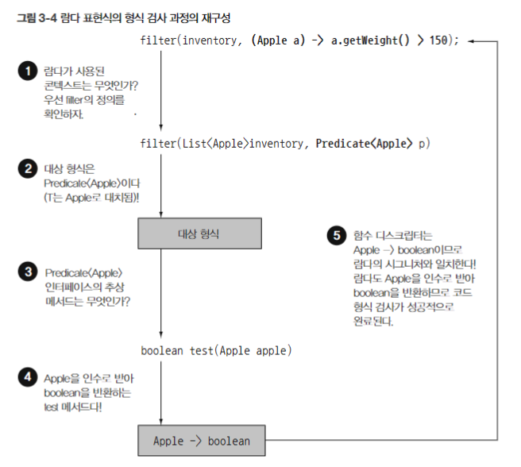

# 3장 - 람다 표현식

- 람다를 사용하면 (익명 클래스처럼) 불필요하거나 자질구레한 보일러 플레이크 코드들을 손쉽게 없애줄 수 있다. 단순히 텍스트를 제거하는 것을 넘어 간결한 코드와 유연함을 만들어준다.
- 함수형 인터페이스란 무엇일까?
    - `Predicate`처럼 함수형 인터페이스의 **추상 메서드 구현(코드 바디)을 직접 전달하기 위함**이 목적이다.
    - 추상 메서드는 반드시 하나만 가져야 하며 defualt method의 개수는 상관없다. `@FunctionInterface` 를 사용하면 컴파일러가 컴파일 타임에 오류를 잡아준다.
- 람다는 자원을 열고 처리한 뒤 닫는 순서로 이뤄지는 패턴인 **실행 어라운드 패턴**에서도 실용적이다.
    - 자원에 가하는 행위들을 람다 형태로 주입해 동일한 자원에 대해 각기 다른 행위를 수행할 수 있다.
- 람다식을 통해서 우린 함수형 인터페이스의 인스턴스를 만들 수 있습니다. 과연 어떻게 람다의 타입을 추론할 수 있을까요?
    - 우선 람다식이 전달되는 메서드 파라미터에서 우리가 기대하는 람다 형식은 **대상 형식**이라고 불립니다. 형식 확인 과정은 아래와 같습니다.
        
        
        
    - 우린 대상 형식을 통해 람다 표현식과 관련된 함수형 인터페이스도 추론할 수 있습니다.
- 람다 표현식에선 익명 함수처럼 파라미터로 넘겨받은 변수가 아닌 람다 외부에서 정의된 **자유 변수(free variable)**도 활용 가능하며, 이를 **람다 캡처링(capturing lambda)**이라고 부릅니다.
    
    
    
    - 물론 이 때 사용되는 **지역 변수들은 변경이 불가능한 상태(final 혹은 실질적으로 final과 같은 상태)**여야만 합니다. 그 이유는 람다가 여러 스레드에 의해 실행되는 경우에서 Memory Corruption 문제가 발생할 수 있기 때문입니다.
- 작성한 함수들에서 비교를 수행하는 Comperator는 연속된 함수의 연결도 가능하다.
    - `Predicate` 의 경우 `and` , `or`
    - `Function` 의 경우 `andThen` , `compose`