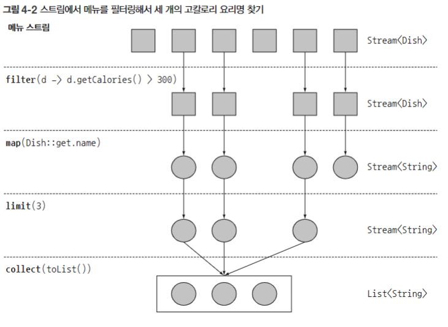

# 4장 : 스트림 소개

- Stream은 자바 8부터 추가된 API다. 컬렉션 데이터를 선언형으로 처리할 수도 있고, 데이터를 병렬로 처리할 수 있다.
    - `stream()` 으로 내부 반복이 가능하며, 병렬 처리의 경우 `parallelStream()` 을 사용하면 된다.
    - Stream API의 특징은 간결하고 가독성을 좋게 만드는 **선언형**, 유연함을 도와주는 **조립 가능**, 성능의 이점을 가져오는 **병렬화** 세 가지다.
- 스트림의 정의는 ‘데이터 처리 연산을 지원하도록 소스에서 추출된 연속된 요소’이다.
    - 스트림은 스트림 연산을 서로 연결해 파이프라인을 구성할 수 있게 한다. 이를 통해 **laziness**, **short-circuitiing**의 성능 최적화도 얻을 수 있다.
    - 스트림의 동작 구조를 잘 표현하는 본문 이미지 중 하나다.
        
        

- 스트림과 컬렉션이 갖는 결정적인 차이는 **메모리**와 **계산 타이밍**이다.
    - 우리가 만약 2시간의 런닝 타임을 갖는 영화를 시청하고자 한다면 혹시 2시간의 비디오의 다운로드 속도를 모두 기다린 뒤 수행하는가?
        - 우린 최초 1분 혹은 10분 등의 앞 프레임을 미리 내려받는다. 이후 영상을 재생하며, 뒷 프레임들을 차차 내려받는다.
        - 하지만 이 작업을 스트림이 아닌 컬렉션, 즉 모두 다운로드가 완료되어야 실행할 수 있다면 얼마나 불편하겠는가
    - 컴퓨터의 관점도 동일하다. 컬렉션은 계산 후 저장하고자 하는 모든 값을 메모리에 저장해야한다.
        - 만약 1KG 이상의 무게를 갖는 사과들의 모음을 저장하고 싶다면 먼저 **존재하는 모든 사과를 메모리에 올린 뒤, 순차적으로 사과들을 계산**한 뒤 저장한다.
        - 하지만 스트림은 사과들의 계산을 **요소들을 요청(추가하려고)할 때만 수행하고 저장**한다.        
- 스트림은 스트림이 생성된 뒤 딱 한번만 탐색할 수 있다. 만약 이미 탐색한 위치를 다시 탐색하려하는 경우 `java.lang.IllegalStateException` 예외가 발생한다.
- 일반적인 for문 혹은 for-each문은 외부 반복이다. 스트림을 통한 내부 반복은 외부 반복에 비해 병렬성 관리가 용이할 뿐만 아니라 여러 최적화가 가능하다.
- 스트림 연산은 연결 가능한 스트림 연산을 뜻하는 중간 연산과 스트림을 닫는 최종 연산으로 나뉜다.
    - 여기서 스트림의 특성을 가장 잘 보여주는 예시가 존재한다.
        
        ```java
        public static void main(String[] args) {
          List<String> names = menu.stream()
              .filter(dish -> {
                System.out.println("filtering " + dish.getName());
                return dish.getCalories() > 300;
              })
              .map(dish -> {
                System.out.println("mapping " + dish.getName());
                return dish.getName();
              })
              .limit(3)
              .collect(toList());
          System.out.println(names);
        }
        ```
        
        - 연산 결과는 아래와 같다.
            
            ```
            filtering:pork
            mapping:port
            filtering:beef
            mapping:beef
            filtering:chicken
            mapping:chicken
            [port, beef, chicken]
            ```
            
        - 보다시피 모든 컬렉션 요소를 미리 저장하지 않고 **요소들을 하나씩 당겨와서 중간 연산들을 통과시키는 형태로 동작**한다.
        - 따라서 `limit(3)` 가 동작할 때 **쇼트서킷** 기법을 통해 모든 요소들을 탐색하지 않고도 연산을 마무리할 수 있다.
        - `filter`, `map` 이 동작할 땐 하나의 연산으로 병합되어 동작하는 **루프 퓨전** 기법도 적용됐다.