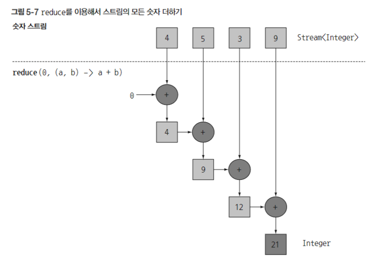

# 5장 : 스트림 활용

- 프레디케이트를 통한 조건식 처리
- `distinct` 를 통한 중복 제거
- 자바 9부터 스트림의 내부 슬라이싱을 통해 성능을 최적화하는 `takeWhile`, `dropWhile`
    - `takeWhile` 을 통해 전체가 아닌 일부만 조건식을 수행하도록 슬라이싱이 가능하다.
        
        ```java
        List<Dish> slicedMenu
        	= specialMenu.stream()
        								.takeWhile(dish -> dish.getCalories() < 320)
        								.collect(toList());
        ```
        
    - dropWhile의 경우 프레디케이트가 처음으로 거짓이 되는 지점까지 발견된 요소를 버린다. 이를 통해 조건식에 부합하지 않는 남은 요소들을 활용한다.
- `limit` 을 통해 특정 값 이하의 크기를 갖는 스트림을 반환할 수 있다.
- `skip` 은 n개의 요소를 건너뛸 수 있게 해준다.
- `map` 을 통해 스트림의 요소를 변환하여 다음 연산에게 넘길 수 있다.
- `flatMap` 을 통해 리스트, 배열과 같은 요소들을 담은 스트림을 1차원 형태로 펼칠 수 있다.
- `anyMatch`, `allMatch`, `nonMatch` 를 통해 요소 일치를 확인할 수 있다.
- `findAny` 를 통해 임의의 요소를 반환할 수 있다. 만약 첫 번째 요소를 얻고 싶다면 `findFirst` 를 활용하자.
- `reduce` 를 통해 스트림 내부에서 요소들을 처리한 결과를 값으로 도출하고 해당 값에 이어서 연산을 진행하는 형태를 띌 수 있다.
    - 예를 들어 숫자를 담은 배열이 존재하고 초기값 1에 계속해서 숫자를 더해야한다면 외부 연산의 경우 아래와 같은 형태를 띈다.
        
        ```java
        int sum=0;
        for (int x: numbers) {
        		sum += x;
        }
        ```
        
    - 반면 `reduce` 를 활용하면 아래처럼 바뀐다.
        
        ```java
        int sum = numbers.stream().reduce(0, (a,b) -> a + b);
        
        int sum = numbers.stream().reduce(0, Integer::sum);
        ```
        
        
        
    - `reduce` 를 통해 연산하게 되면 내부 반복이 추상화된다. 이를 통해 쉽게 병렬화를 진행할 수 있다. 대신 `reduce` 의 인자로 넘어간 (인스턴스 변수 같은) 람다의 상태가 바뀌지 말아야 하고, 연산 순서가 결과에 영향을 끼쳐선 안된다.
- 스트림 연산 시 `map` 을 통해 매핑한 결과를 `reduce` 에 반환해 파이프라인을 형성할 수 있다. 이를 **맵 리듀스(map-reduce) 패턴**이라고 한다.